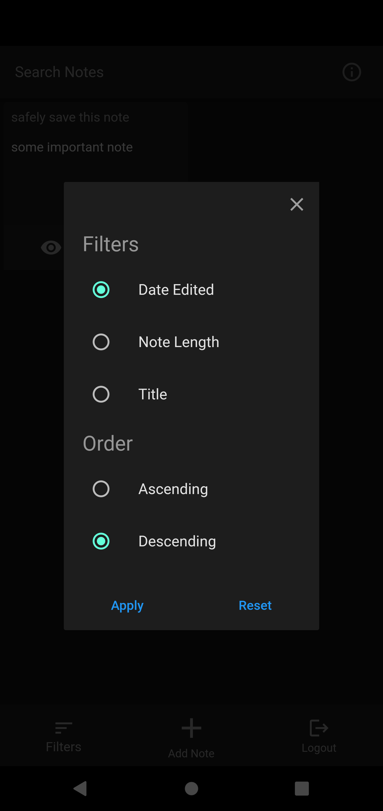

# Only Notes

Notes app built for privacy.

## How to use

You can download the app [here](#). There are only two login methods supported currently.

1. Password less email sign-in
2. Sign in with Google

After signing in with any of the method, you will be prompted to enter an encryption key. There are two scenarios:

1. New user - you need to create new encryption key. Only alphanumeric values are supported for now and the key needs to be 7 to 15 characters long.

    **Note:** This key is not stored in any of out databases and if lost then you will lose all your notes.

2. Existing user - you need to enter your encryption key that you created on your first ever login.

    **Note:** Users can not proceed to next step without the correct key.

After creation or verification of encryption key, user will be redirected to home screen which will display all notes of current user.
Rest of the features in app are self explanatory e.g. delete note, view note, edit note, add note, search note or logout.

## Screenshots

